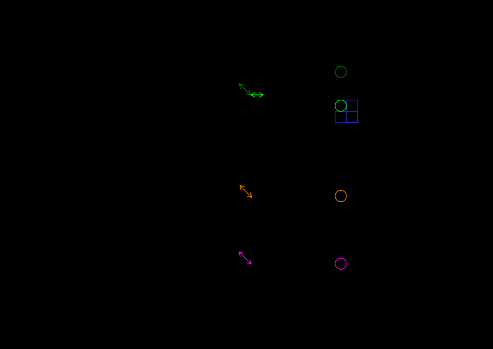

# 🔬 Experiment: EDSR G-loss

---

## ⚛️ Model
- EDSR [1] (src/models/edsr/EDSR)
  - 1 input channel
  - scale factor 10
  - the same architecture as Košťál et al. [2].

## 🗂️ Data
- ReKIS daily mean temperature
  - training set: 1961 - 1992
  - validation set: 1993 - 2002
  - test set: 2003 - 2012

## 📉 Loss function
### Standard aproach (HR dependent)
- Standard MAE loss $\left(\mathcal{L}_{MAE}\right)$ between model output and target.
- G-Loss (src/loss/loss/GLoss) was added [4].
- Derivatives are calculated in all the 8 directions:
$$
C_G = \left\{ 
\begin{bmatrix} -1 & 0 & 0 \\ 0 & 1 & 0 \\ 0 & 0 & 0\end{bmatrix},
\begin{bmatrix} 0 & -1 & 0 \\ 0 & 1 & 0 \\ 0 & 0 & 0\end{bmatrix},
\begin{bmatrix} 0 & 0 & -1 \\ 0 & 1 & 0 \\ 0 & 0 & 0\end{bmatrix},
\begin{bmatrix} 0 & 0 & 0 \\ -1 & 1 & 0 \\ 0 & 0 & 0\end{bmatrix},
\begin{bmatrix} 0 & 0 & 0 \\ 0 & 1 & -1 \\ 0 & 0 & 0\end{bmatrix},
\begin{bmatrix} 0 & 0 & 0 \\ 0 & 1 & 0 \\ -1 & 0 & 0\end{bmatrix},
\begin{bmatrix} 0 & 0 & 0 \\ 0 & 1 & 0 \\ 0 & -1 & 0\end{bmatrix},
\begin{bmatrix} 0 & 0 & 0 \\ 0 & 1 & 0 \\ 0 & 0 & -1\end{bmatrix}
\right\}
$$
- Then the simple gradient loss is:
$$
\mathcal{L}_G = \sum_{i = 1}^8 \left| I^\text{SR} \star C_{G_i} - I^\text{HR} \star C_{G_i} \right|
$$
- Furthermore, Ge et al. added loss between gradient for greater distance than 1.
- We unshuffle (with optional parameter $n$) the images $I^\text{HR}, I^\text{SR}$. 
$$
I^\text{HR}_\text{U} = \text{PixelUnshuffle}(I^\text{HR}, n) \qquad I^\text{SR}_\text{U} = \text{PixelUnshuffle}(I^\text{SR}, n)
$$
- Then apply convolution with the derivative kernels on the unshuffled patches.
$$
G^\text{HR} = I^\text{HR}_\text{U} \star C_G \qquad G^\text{SR} = I^\text{SR}_\text{U} \star C_G
$$
- This way we are essentially calculating gradient on distance $n$ between neighboring pixels.

- So the loss will be:
$$
\mathcal{L}_\text{U} = \text{Mean}\left|G^\text{HR} - G^\text{SR}\right|
$$
- Therefore, the G loss function is:
$$
\mathcal{L} = (1 - \alpha) \cdot \mathcal{L}_{MAE} + \alpha \cdot \left(\mathcal{L}_G + \mathcal{L}_\text{U}\right)
$$
  - where $\alpha$ controls the attention we give the gradient loss.
- for now, we used $\alpha=0.01$.
> TODO: Try other $\alpha$s.

### Soft constraining approach (LR dependent)
- Standard MAE loss $\left(\mathcal{L}_{MAE}\right)$ between model output and target.
- Soft G-loss (src/loss/loss/SoftGLoss) was added [4].
- Similarly to Soft simple gradient loss (experiments/simple_gradient_loss) we obtain $\bar{D}^\text{SR}_1 \dots \bar{D}^\text{SR}_8$ as mean derivatives of SR 
and denote them as $\bar{G}^\text{SR}$.
- The loss will be:
$$
\mathcal{L}_\text{U} = \text{Mean}\left|G^\text{LR} - \bar{G}^\text{SR}\right|
$$
- We cannot compute $\mathcal{L}_G$ here, so the G loss function is:
$$
\mathcal{L} = (1 - \alpha) \cdot \mathcal{L}_{MAE} + \alpha \cdot\mathcal{L}_\text{U}
$$

## ⚙️ Config
- Early stopping based on validation L1 loss (MAE), with patience 10, resp. 15.

## 🚀 Optimizer
- Adam with learning rate 1e-4.

---

## 🏋️‍♂️ Training
- RCI
  - partition: gpu
  - 1 node
  - 1 task per node
  - 1 GPU
  - 8 CPU cores
  - 8 dataloader workers
  - 32 GB RAM
  - batch size: 32
- training logs are saved on RCI in ~/SISR-downscaling/logs/lightning_logs as **version_{6, 16}**.

---

## 🏆 Result

| #experiment | $\alpha$ | lowest validation MAE | lowest validation RMSE | model               | patience | lr   | StepLR | wd   | notes       |
|:------------|:---------|:----------------------|:-----------------------|:--------------------|----------|------|--------|------|-------------|
| 6           | 0.01     | 0.03259               | 0.04231                | EDSR, f:256, rb: 32 | 10       | 1e-4 | -      | -    | G-Loss      |
| 16 (6B)     | 0.01     | **0.02562**           | **0.03146**            | EDSR, f:128, rb: 64 | 15       | 1e-4 | 0.5    | 1e-5 |             |
| 20 (6C)     | 0.01     | 0.02722               | 0.03658                | EDSR, f:128, rb: 64 | 15       | 1e-4 | 0.9    | 1e-5 | soft G-Loss |

- lowest MAE: 0.02562, RMSE: 0.03146
- almost same as standard EDSR (MAE: 0.02552, RMSE: 0.03076) (experiments/standard_edsr.md)

## 📝 Notes
- the standard approach was the best
- this is not a soft constraint, as defined by Harder et al. [5]
- the soft constraint approach **COULD BE** a soft constraint, as defined by Beucler et al. [6]

---

## 👩‍💻 Future work
- [ ] for loss try other $\alpha$s

---

## 📚 Bibliography
1. https://github.com/sanghyun-son/EDSR-PyTorch/tree/master
2. KOŠŤÁL, Petr; KORDÍK, Pavel; PODSZTAVEK, Ondřej. Downscaling
climate projections to 1 km with single-image super resolution. 2025. 
Available from arXiv: 2509.21399 [cs.CV].
3. Lim et al. (2017)
4. Lei Ge, Lei Dou. 2023. G-Loss: A loss function with gradient information for super-resolution.
Optik - International Journal for Light and Electron Optics. https://doi.org/10.1016/j.ijleo.2023.170750.
5. HARDER, Paula; HERNANDEZ-GARCIA, Alex; RAMESH, Venkatesh;
YANG, Qidong; SATTIGERI, Prasanna; SZWARCMAN, Daniela; WATSON, Campbell; 
ROLNICK, David. Hard-Constrained Deep Learning for
Climate Downscaling. 2024. Available from arXiv: 2208.05424 [physics.ao-
ph].
6. BEUCLER, Tom; PRITCHARD, Michael; RASP, Stephan; OTT, Jordan; BALDI, Pierre; GENTINE, Pierre. Enforcing Analytic Constraints
in Neural Networks Emulating Physical Systems. Phys. Rev. Lett. 2021,
vol. 126, p. 098302. Available from doi: 10.1103/PhysRevLett.126.09
