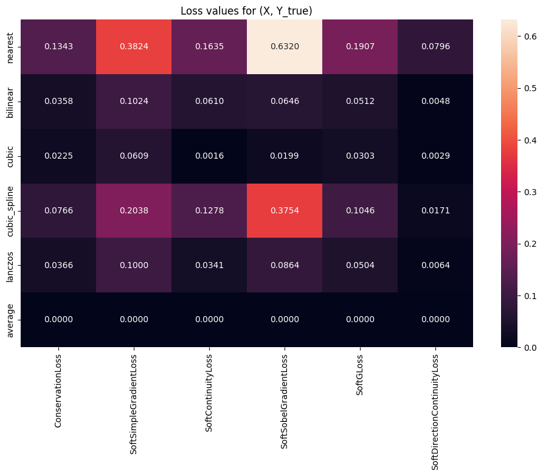
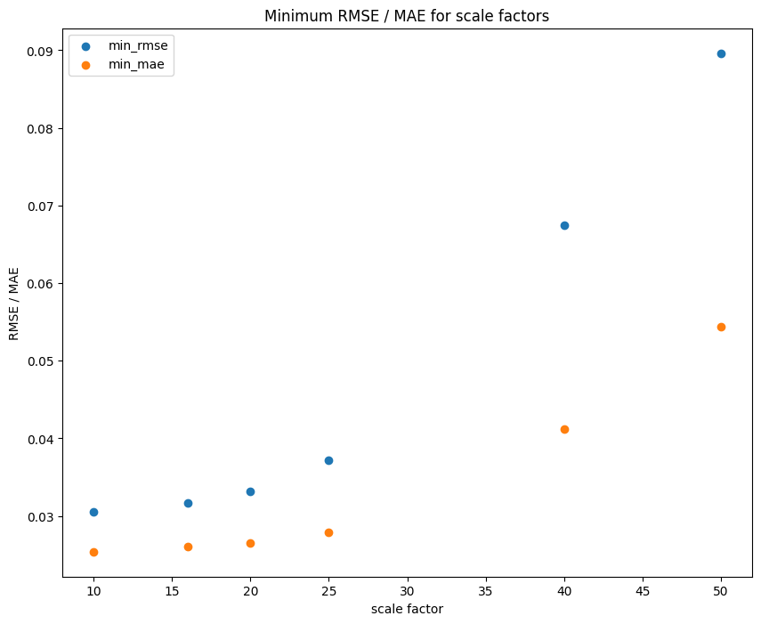
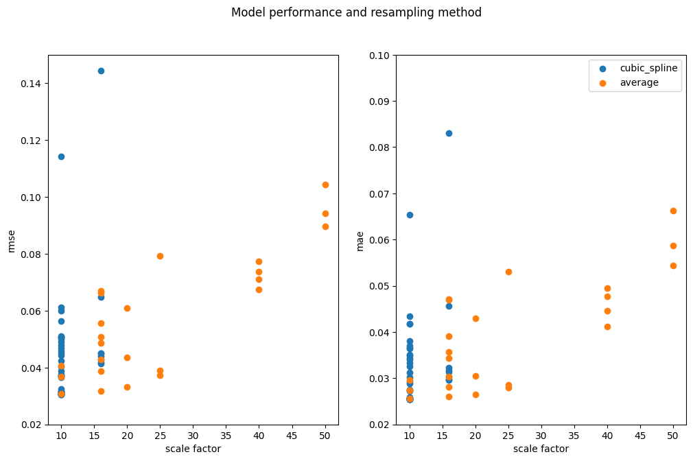
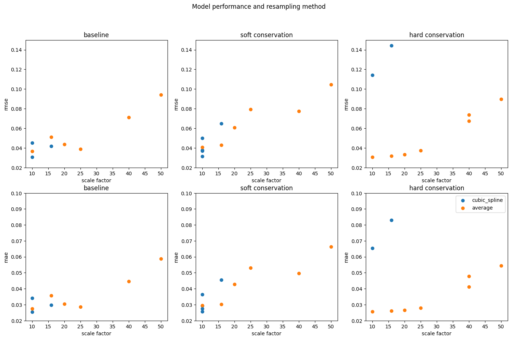
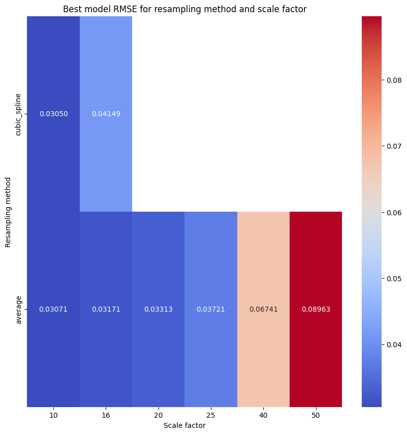
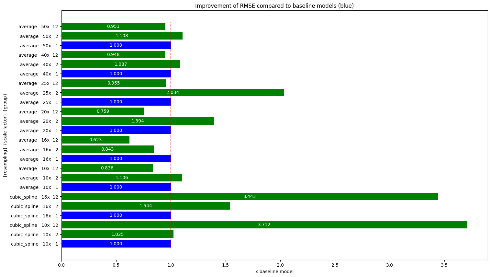

# 🔬 Experiment: Resampling

---

## Role of resampling
- We use HR images $I^\text{HR}$ from ReKIS dataset.
These images are resampled, resulting in LR images $I^\text{LR}$.
LR images are used as input to a model, which produces $I^\text{SR}$, which we want to be as close as possible to $I^\text{HR}$.
- Now, for obtaining $I^\text{LR}$ we can use various resampling methods.
Python library `rasterio` provides:
  - nearest
  - bilinear
  - cubic
  - cubic_spline
  - lanczos
  - average
- One way to measure the quality of resampling, is calculating some loss function. 
Here, to match dimensions, we assumed a LR pixel has size $\text{scale_factor} \times \text{scale_factor}$.   

## Error of resampling
- We calculated, how $I^\text{LR}$ differs from original $I^\text{HR}$ using RMSE and MAE on training set of ReKIS (1961-1992).

| Resampling method | MAE        | RMSE       |
|-------------------|------------|------------|
| nearest           | 0.2323     | 0.4068     |
| bilinear          | 0.2052     | 0.3392     |
| cubic             | 0.2020     | 0.3355     |
| cubic_spline      | 0.2178     | 0.3586     |
| lanczos           | 0.2040     | 0.3394     |
| average           | **0.2004** | **0.3334** |

## Soft constraints
- We calculated the soft constraint loss for $I^\text{LR}$ and $I^\text{HR}$.
Note that this is the case, when the model outputs the true value, so the loss should be zero.

| Resampling method | ConservationLoss | SoftSimpleGradientLoss | SoftContinuityLoss | SoftSobelGradientLoss | SoftGLoss | SoftDirectionContinuityLoss |
|-------------------|------------------|------------------------|--------------------|-----------------------|-----------|-----------------------------|
| nearest           | 0.13428          | 0.38241                | 0.16535            | 0.63199               | 0.19072   | 0.07963                     |
| bilinear          | 0.03583          | 0.10240                | 0.06096            | 0.06462               | 0.05117   | 0.00476                     |
| cubic             | 0.02250          | 0.06090                | 0.00156            | 0.01989               | 0.03032   | 0.00285                     |
| cubic_spline      | 0.07657          | 0.20380                | 0.12777            | 0.37543               | 0.10464   | 0.01708                     |
| lanczos           | 0.03859          | 0.10001                | 0.03410            | 0.08638               | 0.05038   | 0.00636                     |
| average           | **0.00001**      | **0**                  | **0**              | **0**                 | **0**     | **0**                       |

## Training

### Cubic spline resampling

| #experiment | scale_factor | $\alpha$ | lowest validation MAE | lowest validation RMSE | model               | patience | lr   | StepLR | wd   | notes                                   |
|:------------|:------------:|:---------|:----------------------|:-----------------------|:--------------------|----------|------|--------|------|-----------------------------------------|
| 10          |      10      | -        | *0.02552*             | *0.03076*              | EDSR, f:128, rb: 64 | 20       | 1e-4 | -      | 1e-5 | baseline 10x                            |
| 19 (2C)     |      10      | 0.01     | 0.03642               | 0.05001                | EDSR, f:128, rb: 64 | 15       | 1e-4 | 0.9    | 1e-5 | soft conservation                       |
| 21 (12A)    |      10      | -        | 0.06533               | 0.11418                | EDSR, f:128, rb: 64 | 15       | 1e-4 | 0.9    | 1e-5 | hard conservation AddCL                 |
| 33 (2C2)    |      10      | 0.01     | 0.02747               | 0.03698                | EDSR, f:128, rb: 64 | 15       | 1e-4 | 0.9    | 1e-5 | soft conservation (MSE version)         |
| 34 (3C2)    |      10      | 0.01     | **0.02540**           | **0.03050**            | EDSR, f:128, rb: 64 | 15       | 1e-4 | 0.9    | 1e-5 | soft simple gradient loss (MSE version) |
| 39          |      16      | -        | *0.02969*             | *0.04195*              | EDSR, f:128, rb: 64 | 15       | 1e-4 | 0.9    | 1e-5 | baseline 16x                            |
| 40 (2D)     |      16      | 0.01     | 0.04557               | 0.06475                | EDSR, f:128, rb: 64 | 15       | 1e-4 | 0.9    | 1e-5 | soft conservation                       |
| 43 (5D)     |      16      | 0.01     | **0.02961**           | **0.04149**            | EDSR, f:128, rb: 64 | 15       | 1e-4 | 0.9    | 1e-5 | soft Sobel gradient loss                |
| 46 (12B)    |      16      | -        | 0.08308               | 0.14444                | EDSR, f:128, rb: 64 | 15       | 1e-4 | 0.9    | 1e-5 | hard conservation AddCL                 |

### Average resampling

| #experiment  | scale_factor | $\alpha$ | lowest validation MAE | lowest validation RMSE | model               | patience | lr   | StepLR | wd   | notes                              |
|:-------------|:------------:|:---------|:----------------------|:-----------------------|:--------------------|----------|------|--------|------|------------------------------------|
| 48 (10_avg)  |      10      | -        | *0.02737*             | *0.03672*              | EDSR, f:128, rb: 64 | 15       | 1e-4 | 0.9    | 1e-5 | baseline 10x                       |
| 49 (2C_avg)  |      10      | 0.01     | 0.02961               | 0.04060                | EDSR, f:128, rb: 64 | 15       | 1e-4 | 0.9    | 1e-5 | soft conservation                  |
| 50 (12_avg)  |      10      | -        | **0.02555**           | **0.03071**            | EDSR, f:128, rb: 64 | 15       | 1e-4 | 0.9    | 1e-5 | hard conservation AddCL            |
| 51 (14_avg)  |      16      | -        | *0.03569*             | *0.05092*              | EDSR, f:128, rb: 64 | 15       | 1e-4 | 0.9    | 1e-5 | baseline 16x                       |
| 52 (2D_avg)  |      16      | 0.01     | 0.03028               | 0.04295                | EDSR, f:128, rb: 64 | 15       | 1e-4 | 0.9    | 1e-5 | soft conservation                  |
| 53 (12B_avg) |      16      | -        | **0.02609**           | **0.03171**            | EDSR, f:128, rb: 64 | 15       | 1e-4 | 0.9    | 1e-5 | hard conservation  AddCL           |
| 54 (3J_avg)  |      16      | 0.01     | 0.03438               | 0.04867                | EDSR, f:128, rb: 64 | 15       | 1e-4 | 0.9    | 1e-5 | soft simple gradient               |
| 55 (4D_avg)  |      16      | 0.01     | 0.04703               | 0.06695                | EDSR, f:128, rb: 64 | 15       | 1e-4 | 0.9    | 1e-5 | soft continuity                    |
| 56 (5D_avg)  |      16      | 0.01     | 0.02809               | 0.03886                | EDSR, f:128, rb: 64 | 15       | 1e-4 | 0.9    | 1e-5 | soft Sobel gradient                |
| 57 (6D_avg)  |      16      | 0.01     | 0.03905               | 0.05561                | EDSR, f:128, rb: 64 | 15       | 1e-4 | 0.9    | 1e-5 | soft G-Loss                        |
| 58 (8D_avg)  |      16      | 0.01     | 0.04711               | 0.06619                | EDSR, f:128, rb: 64 | 15       | 1e-4 | 0.9    | 1e-5 | soft direction continuity          |
| 59 (15)      |      20      | -        | *0.03056*             | *0.04363*              | EDSR, f:128, rb: 64 | 15       | 1e-4 | 0.9    | 1e-5 | baseline 20x                       |
| 60 (2E)      |      20      | 0.01     | 0.04290               | 0.06083                | EDSR, f:128, rb: 64 | 15       | 1e-4 | 0.9    | 1e-5 | soft conservation                  |
| 61 (12C)     |      20      | -        | **0.02651**           | **0.03313**            | EDSR, f:128, rb: 64 | 15       | 1e-4 | 0.9    | 1e-5 | hard conservation  AddCL           |
| 62 (16)      |      25      | -        | *0.02857*             | *0.03895*              | EDSR, f:128, rb: 64 | 15       | 1e-4 | 0.9    | 1e-5 | baseline 25x                       |
| 63 (2F)      |      25      | 0.01     | 0.05301               | 0.07922                | EDSR, f:128, rb: 64 | 15       | 1e-4 | 0.9    | 1e-5 | soft conservation                  |
| 64 (12D)     |      25      | -        | **0.02792**           | **0.03721**            | EDSR, f:128, rb: 64 | 15       | 2e-4 | 0.9    | 1e-5 | hard conservation  AddCL           |
| 65 (17)      |      40      | -        | *0.04453*             | *0.07114*              | EDSR, f:128, rb: 64 | 15       | 1e-4 | 0.9    | 1e-5 | baseline 40x                       |
| 66 (2G)      |      40      | 0.01     | 0.04956               | 0.07730                | EDSR, f:128, rb: 64 | 15       | 1e-4 | 0.9    | 1e-5 | soft conservation                  |
| 67 (12E)     |      40      | -        | **0.04119**           | **0.06741**            | EDSR, f:128, rb: 64 | 15       | 4e-4 | 0.9    | 1e-5 | hard conservation  AddCL           |
| 68 (12F)     |      40      | -        | 0.04778               | 0.07372                | EDSR, f:128, rb: 64 | 15       | 2e-4 | 0.9    | 1e-5 | hard conservation  AddCL + VarLoss |
| 69 (18)      |      50      | -        | *0.05875*             | *0.09428*              | EDSR, f:128, rb: 64 | 15       | 1e-4 | 0.9    | 1e-5 | baseline 50x                       |
| 70 (2H)      |      50      | 0.01     | 0.06629               | 0.10442                | EDSR, f:128, rb: 64 | 15       | 1e-4 | 0.9    | 1e-5 | soft conservation                  |
| 71 (12G)     |      50      | -        | **0.05434**           | **0.08963**            | EDSR, f:128, rb: 64 | 15       | 2e-4 | 0.9    | 1e-5 | hard conservation  AddCL           |

## Results

### Relations with scale factor
- Minimal achieved pixel-wise RMSE and MAE for each scale factor is displayed below

  - this is not a surprise, with increasing scale factor the error rises.  

### Relations with resampling method
- Now, all the experiments will be shown, with accent on division by resampling method

  - here we can see, that for scale factor 10, the *cubic_spline* is slightly better, but for 16, the *average* resampling significantly improves the model performance

- Now the experiments are furtherly divided by used constraining.

  - it is obvious that from scale factor 16, hard-constrained average resampling dominates the experiments
  - on the other hand, constraining is not helping for cubic spline models

- Here are the best performing model's RMSEs divided by scale factor and resampling method

  - slightly increasing the scale factor means significant problems for cubic spline resampling, whereas average resampling is much more stable.
  - performance of the best model with cubic spline and scale factor 16, is even more than with average resampling and scale factor 25
  - that's the reason, why we stopped experimenting for cubic_spline with scale_factor 16, but that can be later appended

### Improvement from baseline
- The next plot shows, how the constraining methods (conservation law (preserves the mean) in soft- (group = 2) and hard-constraint (group = 12) form)
helped the baseline (group = 1) model's performance (blue).
- Note that, the values in green show the ratio between the particular model RMSE and baseline model of corresponding resampling method and scale factor.
So, if the model improved from baseline, the value is less than zero.

  - we can see that the models working with cubic spline resampling are worse when using some kind of constraining.
  This can be caused by high values of loss functions applied on input (resampled target) and target.
  Therefore, the model learns to minimize something, that in reality is not zero.
  - Highest improvement rates are visible for average resampling and scale_factor 16 and 25.
  The higher the scale factor, the less is the improvement significant.
