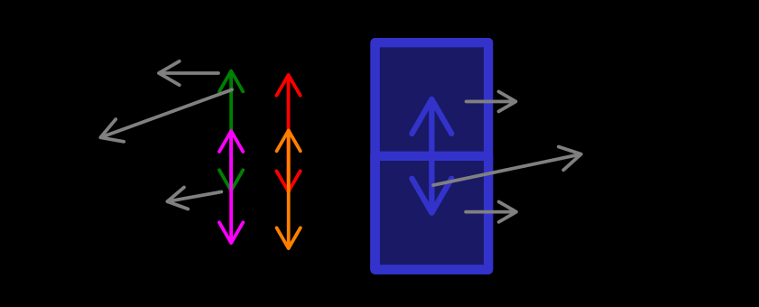

# 🔬 Experiment: EDSR simple gradient loss

---

## ⚛️ Model
- EDSR [1] (src/models/edsr/EDSR)
  - 1 input channel
  - scale factor 10
  - the same architecture as Košťál et al. [2].

## 🗂️ Data
- ReKIS daily mean temperature
  - training set: 1961 - 1992
  - validation set: 1993 - 2002
  - test set: 2003 - 2012

## 📉 Loss function

### Standard approach (HR dependent)

- Standard MAE loss $\left(\mathcal{L}_{MAE}\right)$ between model output and target.
- Simple gradient loss (src/loss/loss/SimpleGradientLoss).
- Simple derivative with respect to x was calculated by convolution with kernel $\begin{bmatrix} 1 & -1\end{bmatrix}$.
Similarly, derivative with respect to y with kernel $\begin{bmatrix} 1 \\ -1\end{bmatrix}$.
- Then the derivatives of $I^\text{HR}$ and $I^\text{SR}$ are:
$$
D^\text{HR}_x = I^\text{HR} \star \begin{bmatrix} 1 & -1\end{bmatrix} \qquad D^\text{SR}_x = I^\text{SR} \star \begin{bmatrix} 1 & -1\end{bmatrix}
$$
$$
D^\text{HR}_y = I^\text{HR} \star \begin{bmatrix} 1 \\ -1\end{bmatrix} \qquad D^\text{SR}_y = I^\text{SR} \star \begin{bmatrix} 1 \\ -1\end{bmatrix}
$$
- Then the simple gradient loss function will be:
$$
\mathcal{L}_D = MAE(D^\text{HR}_x, D^\text{SR}_x) + MAE(D^\text{HR}_y, D^\text{SR}_y)
$$
> TODO: try MSE
- Therefore, the final loss function is:
$$
\mathcal{L} = (1 - \alpha) \cdot \mathcal{L}_{MAE} + \alpha \cdot \mathcal{L}_D
$$
  - where $\alpha$ controls the attention we give the gradient loss.
- for now, we used $\alpha=0.01$ and $MAE$ for gradient loss.
> TODO: Try MSE and other $\alpha$s.

### Soft constraining approach (LR dependent)

- Standard MAE loss $\left(\mathcal{L}_{MAE}\right)$ between model output and target.
- Soft simple gradient loss (src/loss/loss/SoftSimpleGradientLoss).
- This approach is slightly different from above.
  Here we have images of different sizes (LR and SR), and the gradient loss is not so straightforward as above.
- The difference from above is that instead of using raw SR derivatives, we will use mean SR differences between groups of downscaled pixels, 
which should be the same as LR derivatives.
- Formally, assume we have pixels indexed as $I^\text{LR}_{i,j}$ for LR pixel in $i$-th pixel in $j$-th row and SR pixels
  downscaled from $I^\text{LR}_{i,j}$ indexed as 
$\left\{ I^\text{SR}_{i,j,k} \mid k \in \left\{1, 2, \dots \text{scale_factor}^2 \right\}  \right\}$.
- Then the assumption is that the mean difference $I^\text{SR}_{i,j,k}$ between $I^\text{SR}_{i + 1,j,k}$ by corresponding
 $k$ is equal to the difference between corresponding LR pixels:
$$ \frac{1}{\text{scale_factor}^2} \sum_{k = 1}^{\text{scale_factor}^2} I^\text{SR}_{i,j,k} - I^\text{SR}_{i + 1,j,k} = I^\text{LR}_{i,j,k} - I^\text{LR}_{i + 1,j,k}$$

- The above equation was implemented as:
$$ I^\text{SR}_U = \text{PixelUnshuffle}\left(I^\text{SR}, \text{scale_factor}\right) $$
- Simple derivative with respect to x was calculated by convolution with kernel $\begin{bmatrix} 1 & -1\end{bmatrix}$.
Similarly, derivative with respect to y with kernel $\begin{bmatrix} 1 \\ -1\end{bmatrix}$.
- Then the derivatives of $I^\text{HR}$ and $I^\text{SR}_U$ are:
$$
D^\text{LR}_x = I^\text{LR} \star \begin{bmatrix} 1 & -1\end{bmatrix} \qquad D^\text{SR}_{U_x} = I^\text{SR}_U \star \begin{bmatrix} 1 & -1\end{bmatrix}
$$
$$
D^\text{LR}_y = I^\text{LR} \star \begin{bmatrix} 1 \\ -1\end{bmatrix} \qquad D^\text{SR}_{U_y} = I^\text{SR}_U \star \begin{bmatrix} 1 \\ -1\end{bmatrix}
$$
- Now, we calculate the mean differences
$$
\bar{D}^\text{SR}_x = \text{Mean}\left( D^\text{SR}_{U_x} \right) \qquad \bar{D}^\text{SR}_y = \text{Mean}\left( D^\text{SR}_{U_y} \right)
$$
- Then the soft simple gradient loss function will be:
$$
\mathcal{L}_D = MAE(D^\text{LR}_x, \bar{D}^\text{SR}_x) + MAE(D^\text{LR}_y, \bar{D}^\text{SR}_y)
$$
> TODO: try MSE
- Therefore, the final loss function is:
$$
\mathcal{L} = (1 - \alpha) \cdot \mathcal{L}_{MAE} + \alpha \cdot \mathcal{L}_D
$$
  - where $\alpha$ controls the attention we give the gradient loss.
- for now, we used $\alpha=0.01$ and $MAE$ for gradient loss.
> TODO: Try MSE and other $\alpha$s.

- We also provide a table of dimensions, to make them more clear.

| Variable              | Dimension                                                          |
|-----------------------|--------------------------------------------------------------------|
| $I^\text{LR}$         | $(B, 1, H, W)$                                                     |
| $I^\text{SR}$         | $(B, 1, H \cdot \text{scale_factor}, W \cdot \text{scale_factor})$ |
| $I^\text{SR}_U$       | $(B, \text{scale_factor}, H, W)$                                   |
| $D^\text{SR}_{U_x}$   | $(B, \text{scale_factor}, H, W - 1)$                               |
| $D^\text{SR}_{U_y}$   | $(B, \text{scale_factor}, H - 1, W)$                               |
| $\bar{D}^\text{SR}_x$ | $(B, 1, H, W - 1)$                                                 |
| $\bar{D}^\text{SR}_y$ | $(B, 1, H - 1, W)$                                                 |
| $D^\text{LR}_x$       | $(B, 1, H, W - 1)$                                                 |
| $D^\text{LR}_y$       | $(B, 1, H - 1, W)$                                                 |

## ⚙️ Config
- Early stopping based on validation MAE, resp. RMSE, with patience 10, resp. 15.

## 🚀 Optimizer
- Adam with learning rates 1e-3, 1e-4, 1e-5.

---

## 🏋️‍♂️ Training
- RCI
  - partition: gpu
  - 1 node
  - 1 task per node
  - 1 GPU
  - 8 CPU cores
  - 8 dataloader workers
  - 32 GB RAM
- training logs are saved on RCI in ~/SISR-downscaling/logs/lightning_logs as **version_{3, 13, 23, 27, 28, 29, 30, 31, 32}**.

---

## 🏆 Result
| #experiment | $\alpha$ | lowest validation MAE | lowest validation RMSE | model               | patience | lr   | StepLR | wd   | notes                                           |
|:------------|:---------|:----------------------|:-----------------------|:--------------------|----------|------|--------|------|-------------------------------------------------|
| 3           | 0.01     | 0.03436               | 0.0461                 | EDSR, f:256, rb: 32 | 10       | 1e-4 | -      | -    | simple gradient loss                            |
| 13 (3B)     | 0.01     | 0.03700               | 0.05071                | EDSR, f:128, rb: 64 | 15       | 1e-4 | 0.9    | 1e-5 |                                                 |
| 23 (3C)     | 0.01     | **0.02544**           | **0.03062**            | EDSR, f:128, rb: 64 | 15       | 1e-4 | 0.9    | 1e-5 | soft simple gradient loss                       |
| 27 (3D)     | 0.01     | -                     | -                      | EDSR, f:128, rb: 64 | 15       | 1e-3 | 0.9    | 1e-5 | soft simple gradient loss                       |
| 28 (3E)     | 0.01     | 0.03119               | 0.04435                | EDSR, f:128, rb: 64 | 15       | 1e-5 | -      | 1e-5 | soft simple gradient loss                       |
| 29 (3F)     | 0.1      | 0.02880               | 0.03863                | EDSR, f:128, rb: 64 | 15       | 1e-4 | 0.9    | 1e-5 | soft simple gradient loss                       |
| 30 (3G)     | 0.001    | 0.02551               | 0.03087                | EDSR, f:128, rb: 64 | 15       | 1e-4 | 0.9    | 1e-5 | soft simple gradient loss                       |
| 31 (3H)     | 0.01     | 0.02587               | 0.03248                | EDSR, f:128, rb: 64 | 15       | 1e-4 | 0.9    | 1e-5 | soft simple gradient loss; bs = 64              |
| 32 (3I)     | 0.01     | 0.04171               | 0.05634                | EDSR, f:128, rb: 64 | 15       | 1e-4 | 0.9    | 1e-5 | soft simple gradient loss; gradient_clipping(5) |

- lowest validation MAE: 0.02544, RMSE: 0.03062
- almost same as standard EDSR (MAE: 0.02552, RMSE: 0.03076) (experiments/standard_edsr.md)

## 📝 Notes
- the soft constraining approach, as average of unshuffled SR gradients, is present in more experiments
- **soft constraining** (3C) has clearly positive impact on model's performance, compared to standard approach (3, 3B)
- the improvement compared to baseline model is negligible TODO: improve !!
- trying lower/higher learning rates (3D, 3E) does **not** seem to **improve** performance
- trying lower/higher $\alpha$'s (3F, 3G) does **not** seem to **improve** performance
- trying **higher batch size** (3H) does **not** seem to **improve** performance
- gradient clipping (3I) does **not** seem to **improve** performance
- experiment 3D failed, because there was a NaN value in loss function.
  We think it was due to high learning rate, which could lead to very large numbers.
  The soft simple gradient loss, does not use anywhere any division, nor square root, which could lead to some numerical instabilities.
- this is not a soft constraint, as defined by Harder et al. [4]
- the soft constraint approach **COULD BE** a soft constraint, as defined by Beucler et al. [5]

---

## 👩‍💻 Future work
- [ ] for soft simple gradient loss try MSE
- [X] for loss try other $\alpha$s
- [X] try other soft constraints

---

## 📚 Bibliography
1. https://github.com/sanghyun-son/EDSR-PyTorch/tree/master
2. KOŠŤÁL, Petr; KORDÍK, Pavel; PODSZTAVEK, Ondřej. Downscaling
climate projections to 1 km with single-image super resolution. 2025. 
Available from arXiv: 2509.21399 [cs.CV].
3. Lim et al. (2017)
4. HARDER, Paula; HERNANDEZ-GARCIA, Alex; RAMESH, Venkatesh;
YANG, Qidong; SATTIGERI, Prasanna; SZWARCMAN, Daniela; WATSON, Campbell; 
ROLNICK, David. Hard-Constrained Deep Learning for
Climate Downscaling. 2024. Available from arXiv: 2208.05424 [physics.ao-
ph].
5. BEUCLER, Tom; PRITCHARD, Michael; RASP, Stephan; OTT, Jordan; BALDI, Pierre; GENTINE, Pierre. Enforcing Analytic Constraints
in Neural Networks Emulating Physical Systems. Phys. Rev. Lett. 2021,
vol. 126, p. 098302. Available from doi: 10.1103/PhysRevLett.126.09
